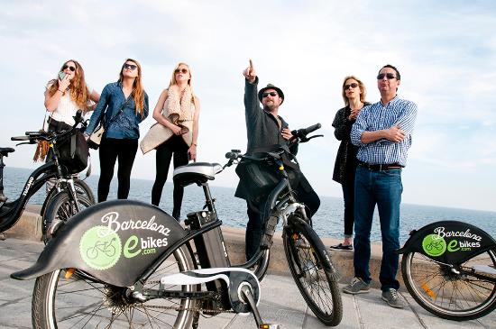

<script> 
    $(document).ready(function() { 
    $head = $('#header'); 
    $head.prepend('<A href = https://www.cuttingedge-events.com></A>') 
    }); 
</script> 

<style>

.precio{
background-color:#828282;
color: white;
padding: 10px;
border: 1px solid black;
margin-left: 5px;
border-radius: 5px;
font-style: italic;
}
</style>


<style>
.list-group-item.active, .list-group-item.active:focus, .list-group-item.active:hover {
    background-color: #EA5933;
}
</style>

<style>
.nav>li>a {
    position: relative;
    display: block;
    padding: 10px 15px;
    color: #EA5933;
    font-weight: bold;
}
.nav-pills>li.active>a, .nav-pills>li.active>a:hover, .nav-pills>li.active>a:focus {
    color: white;
    background-color: #EA5933;
}

</style>


```{r setup, include=FALSE}
knitr::opts_chunk$set(echo = FALSE, message=FALSE, warning=FALSE)
```


```{r libraries}
library(readxl)
library(dplyr)
library(knitr)
library(timevis)

```


# Introduccón

Siguiendo su petición, a continuación le presentamos:

* Sugerencias de restaurantes situados cerca del mar, especializados en arroces y pescado.

* Restaurantes situados en el centro de la ciudad: tradicionales, de tapas y vanguardistas.

* Restaurantes especiales por su diseño o su localización.
  
* Una opción de cena más espectáculo flamenco.
  
* Actividades de medio dia que permiten conocer la ciudad y sus "imprescindibles"
  

<br>
<br>

# Mapa

En este mapa se muestra la localización de los restaurantes que recomendamos y el punto de salida de algunas de las actividades: Bicicletas eléctricas y Segway

<iframe src="https://www.google.com/maps/d/embed?mid=1aRaYGBRiHan_TStAu0vc9PwjJPp5-bbS&hl=es" width="100%" height="480"></iframe>


# Restaurantes Cerca del Mar

## Cal Pinxo Palau de Mar

<iframe src="CalPinxo/CalPinxo.html"  frameborder="0" width="100%" height="1200" scrolling="no"></iframe>

<div class="precio">
<p> PRECIOS: 
  <ul>
* Menu básico compuesto por entrantes a compartir, principal, postre, incluyendo bebida (1 botella de vino cada 3 pax, agua y café) desde:47,50€ IVA inc
   </ul>
</p>
</div>

</br>
</br>


## Can Fisher

<iframe src="CanFisher/CanFisher.html"  frameborder="0" width="100%" height="1200" scrolling="no"></iframe>

<div class="precio">
<p> PRECIOS: 
  <ul>
* Menu básico de tapas a compartir, postre, incluyendo bebida (1 botella de vino cada 3 pax, agua y café) desde: 54€ IVA inc
   </ul>
</p>
</div>

</br>
</br>

## Tinglado

<iframe src="Tinglao/Tinglao.html"  frameborder="0" width="100%" height="1200" scrolling="no"></iframe>

<div class="precio">
<p> PRECIOS: 
  <ul>
* Menu básico compuesto por entrantes a compartir, principal, postre, incluyendo bebida (1 botella de vino cada 3 pax, agua y café) desde:44,50€ IVA inc
   </ul>
</p>
</div>

</br>
</br>

## Cangrejo Loco

<iframe src="CangrejoLoco/CangrejoLoco.html"  frameborder="0" width="100%" height="1200" scrolling="no"></iframe>

<div class="precio">
<p> PRECIOS: 
  <ul>
* Menu básico compuesto por entrantes a compartir, principal, postre, incluyendo bebida (1 botella de vino cada 3 pax, agua y café) desde: 46,50€ IVA inc
   </ul>
</p>
</div>

</br>
</br>


# Restaurantes situados en el centro 

## Alba Granados

<iframe src="Alba Granados/Alba Granados.html"  frameborder="0" width="100%" height="1200" scrolling="no"></iframe>

<div class="precio">
<p> PRECIOS: 
  <ul>
* Menu básico compuesto por entrantes a compartir, principal, postre, incluyendo bebida (1 botella de vino cada 3 pax, agua y café) desde:50€ IVA inc
   </ul>
</p>
</div>

</br>
</br>


## El Glop Braseria

<iframe src="BraseriaElGlop/Glop.html"  frameborder="0" width="100%" height="1200" scrolling="no"></iframe>

<div class="precio">
<p> PRECIOS: 
  <ul>
* Menu básico compuesto por entrantes a compartir, principal, postre, incluyendo bebida (1 botella de vino cada 3 pax, agua y café) desde:37.50€ IVA inc
   </ul>
</p>
</div>

</br>
</br>

## Anita Flow

<iframe src="Anita Flow/AnitaFlow.html"  frameborder="0" width="100%" height="1200" scrolling="no"></iframe>

<div class="precio">
<p> PRECIOS: 
  <ul>
* Menu básico compuesto por entrantes a compartir, principal, postre, incluyendo bebida (1 botella de vino cada 3 pax, agua y café) desde:44€ IVA inc
   </ul>
</p>
</div>

## Lonja de Tapas


<iframe src="Lonja de Tapas/LonjadeTapas.html"  frameborder="0" width="100%" height="1200" scrolling="no"></iframe>

<div class="precio">
<p> PRECIOS: 
  <ul>
* Menu básico de tapas a compartir, postre, incluyendo bebida (1 botella de vino cada 3 pax, agua y café) desde: 38€ IVA inc
   </ul>
</p>
</div>

<br>
<br>

# Especiales por su localización 

</br>

## Dos Torres

<iframe src="Dos Torres/DosTorres.html"  frameborder="0" width="100%" height="1200" scrolling="no"></iframe>

<div class="precio">
<p> PRECIOS: 
  <ul>
* Menu básico compuesto por entrantes a compartir, principal, postre, incluyendo bebida (1 botella de vino cada 3 pax, agua y café) desde:52€ IVA inc
   </ul>
</p>
</div>

</br>
</br>

## Can Travi Nou

<iframe src="Can Travi Nou/CanTravi.html"  frameborder="0" width="100%" height="1200" scrolling="no"></iframe>

<div class="precio">
<p> PRECIOS: 
  <ul>
* Menu básico compuesto por 3 platos incluyendo bebida (1 botella de vino cada 3 pax, agua y café) desde:55€ IVA inc
   </ul>
</p>
</div>

</br>
</br>

## Torre d'Alta Mar

<iframe src="Torre d'Alta Mar/Torre.html"  frameborder="0" width="100%" height="1100" scrolling="no"></iframe>

<div class="precio">
<p> PRECIOS: 
  <ul>
* Menu básico compuesto por 4 platos incluyendo bebida (1 botella de vino cada 3 pax, agua y café) desde: 96,50€ IVA inc
   </ul>
</p>
</div>

</br>
</br>

# Flamenco en Barcelona 

Recomendamos el Tablao que a nuestro criterio es el más auténtico de la ciudad **El Tablao de Carmen**.

Está situado dentro del Pueblo Español. Es un museo al aire libre donde se han querido representar las diferentes culturas y arquitecturas de España.

Por lo que podemos encontrar un típico barrio Sevillano de casas blancas y calles estrechas, en este barrio encontramos El Tablao de Carmen. Es un local mediano y reproduce fielmente la estructura de los tablaos tal y como eran tradicionalmente.

Se puede cenar mientras se disfruta del escenario una cena tradicional acompañada por un buen vino o sangría.

<iframe width="100%" height="505" src="https://www.youtube.com/embed/jRM8A_MR_RM" frameborder="0" allow="accelerometer; autoplay; encrypted-media; gyroscope; picture-in-picture" allowfullscreen></iframe>

</br>

El Tablao ofrece dos horarios a elegir según disponibilidad:

* Primer pase: cena 18.00h y espectáculo a partir de las 18.45h
* Segundo pase: cena 20.30h y espectáculo a partir de las 21.15h

<div class="precio">
<p> PRECIOS: 
  <ul>
* Menu básico de tapas incluyendo bebida (1 botella de vino cada 3 pax, agua y café) desde: 65€ IVA inc -
* Menu compuesto de entrantes para compartir, plato principal, postre, bebidas y café, desde: 85€ IVA inc
   </ul>
</p>
</div>

*El precio del menú incluye el espectáculo y la entrada al Pueblo Español*

</br>
</br>

# Actividades en Barcelona 

## City tour en bicicleta eléctrica

Proponemos un tour en bicicleta eléctrica para conocer la ciudad, este tour es personalizable y tiene una duración aproximada de 3h.

El grupo de 15 personas tendrá un guía que estará todo el tiempo con ellos explicándole las partes más importantes de la ciudad. También tendrán asistencia en caso de que alguien pinche o tenga un problema con la bici, poder solucionarlo en muy poco tiempo para poder continuar con el tour lo antes posible.

Es posible empezar y terminar el tour en un punto personalizado que puede ser delante del hotel, por ejemplo y terminar en el restaurante de la cena...este servicio tiene un precio extra.



<div class="precio">
<p> PRECIOS: 
  <ul>
* Tour de 3h por Barcelona incluyendo un guia cada 15 personas, casco y seguro, empezando y terminando en el local de alquiler: 40€ por persona IVA inc

* Traslado de las bicicletas para comenzar o terminar en un punto determinado por el cliente: 200€ IVA inc
   </ul>
</p>
</div>

<br>
<br>

## Tour guiado en Segway

Os proponemos una manera muy divertida de conocer la ciudad. Estos patinetes eléctricos son muy fáciles de conducir y se realiza un pequeño entrenamiento antes de comenzar el tour.

El punto estandard para comenzar es el Arco del Triunfo, allí es donde se les dará a los invitados las primeras nociones y se les dividirá en grupos pequeños.

Por ley en Barcelona los segways sólo pueden circular en grupos de 6 personas mas el guia, así que los dividiremos y irán un grupo detras del otro.

Como en el tour en bicicleta eléctrica el punto de comienzo o de fin es personalizable, pero los segways tienen algunas restricciones, hay algunas zonas de la ciudad por las que no pueden circular.


<div class="precio">
<p> PRECIOS: 
  <ul>
* Tour guiado de 2horas, incluyendo 1 guia cada 6/7 personas: 70€ IVA inc

* Transporte de los segways para comenzar o acabar en un punto determinado por el cliente: 200€ IVA inc
   </ul>
</p>
</div>

<br>
<br>

## Gaudí Tour


Nuestra guia oficial recogerá a los invitados en el hotel y con un minibus privado recorrerán la ciudad viendo las obras maestras del modernismo catalán, principalmente de **Antonio Gaudí** como son la Pedrera o la Casa Batlló, ambas situadas en el Paseo de Gracia.

Durante el tour harán una parada en la Sagrada Familia, donde la guía explicará el significado de las diferentes fachadas y luego harán una visita al interior - la visita a este templo es considerada como uno de los imprescindibles a realizar al visitar la ciudad-


<div class="precio">
<p> PRECIOS: 
  <ul>
* Guía oficial de Barcelona - 4h: 265€ IVA inc

* Bus de 18 plazas a disposición 4 horas para la visita: 270€ IVA inc

* Entrada básica de grupos a la Sagrada Familia (se tiene que comprar 3 meses antes): 25€ IVA inc por persona
   </ul>
</p>
</div>

<br>
<br>


## FCB Tour


La idea de este tour es combinar una visita guiada por la ciudad, visitando zonas de Montjuic como el estadio olímpico, plaza España y haciendo una parada para visitar el museo más visitado de la ciudad: El museo del Barça.

La guia recogerá a los invitados en el hotel o el restaurante y recorrerán gran parte de la ciudad mientras les explica un poco la historia de la ciudad, su arquitectura, las costumbres...

Una vez el bus pare en el Camp Nou los clientes entraran en el estadio donde podrán ver a parte del museo, zonas como los vestuarios, el banquillo, etc que normalmente no están accesibles al público.


<div class="precio">
<p> PRECIOS: 
  <ul>
* Guía oficial de Barcelona - 4h: 265€ IVA inc

* Bus de 18 plazas a disposición 4 horas para la visita: 270€ IVA inc

* Entrada básica de grupos al Museo y al estadio Camp Nou: 35€ IVA inc por persona
   </ul>
</p>
</div>

<br>
<br>


# Condiciones

  * Precios netos para CuatroF
  
  * Los honorarios de Cutting Edge Events está incluido en los precios
  
  * Todos los precios incluyen IVA 
  
  * No se ha realizado ninguna reserva. Una vez confirmado se comprobará la disponibilidad.

<br>
<br>

## Sorprendan a sus clientes!!

<div class="client_offer">

<p>¿Les ha gustado nuestra presentación? La meta principal de _**CUTT/events**_ es ayudarles a **ganar** este negocio. Seguramente ahora copiarían toda la información que contiene esta web y harían su propia presentación.<br>

<p>Pero...¿porqué no utilizar nuestra tecnología y presentar esta propuesta a su cliente en nuestro formato? Ahora les ofrecemos, como un servicio **totalmente gratuito**, la posibilidad de poder sorprender a sus clientes con su novedosa propuesta. </p>

<p> ¿Cómo lo hacemos?: 
  <ul>
  
* Seguimos sus instrucciones para añadir cualquier cosa que quiran que esté incluida en su presentación y borrar cualquier otra información que consideren irrelevante.
    
* Incluimos el logo e información de su empresa y eliminamos todos nuestros datos.
    
* Podemos incluso cambiar algunos de los colores para que se asemeje más a su imagen corporativa.
    
* Una vez finalizada le enviaremos un nuevo link que no tendrá ninguna referencia a Cutting Edge Events para que puedan enviarlo a sus clientes como una presentación propia.
  </ul>
</p>
</div>

<style>

.client_offer{
background-color: #ee7600;
color: white;
padding: 10px;
border: 1px solid black;
margin-left: 25px;
border-radius: 5px;
font-style: italic;
}
</style>

******************


